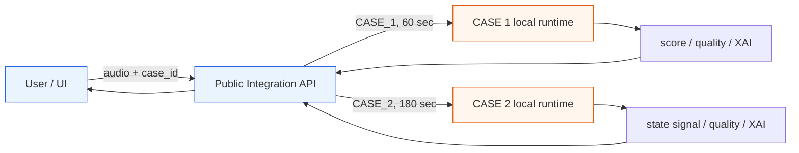
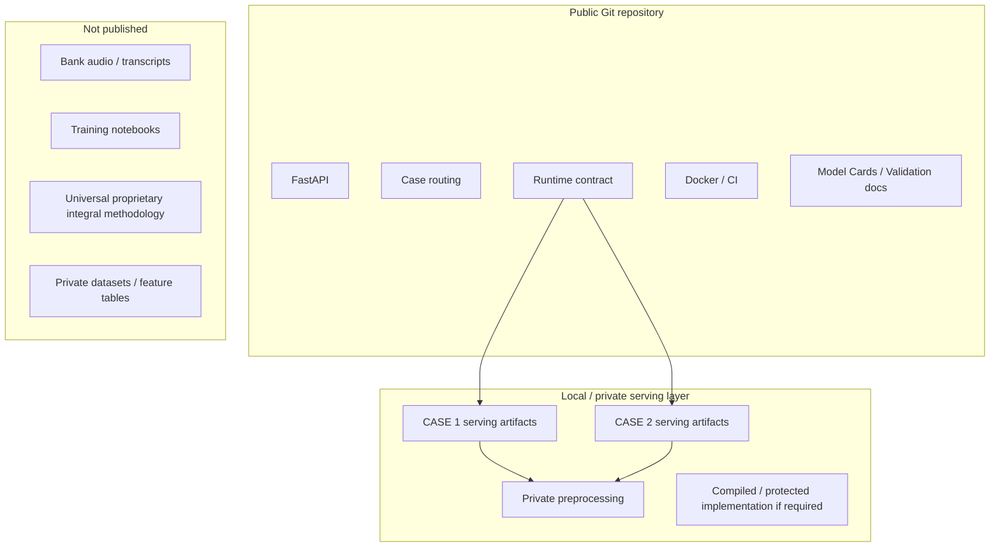
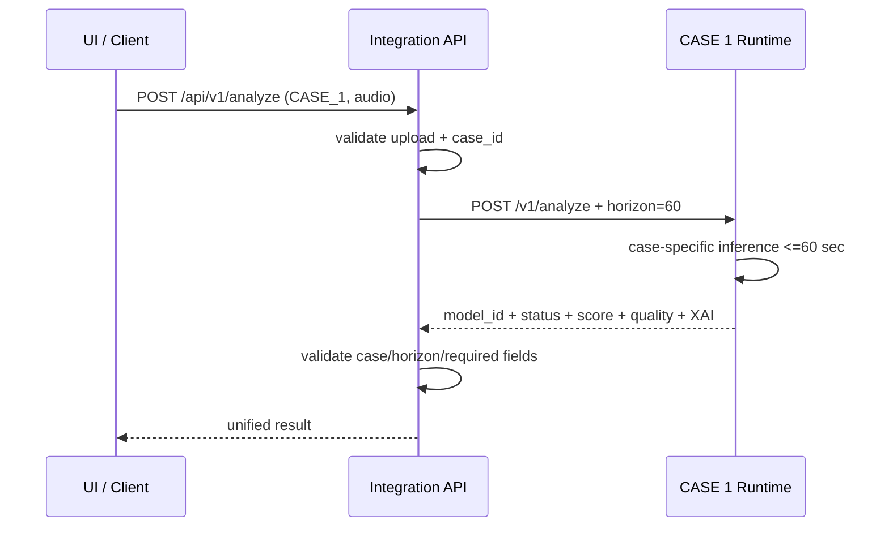
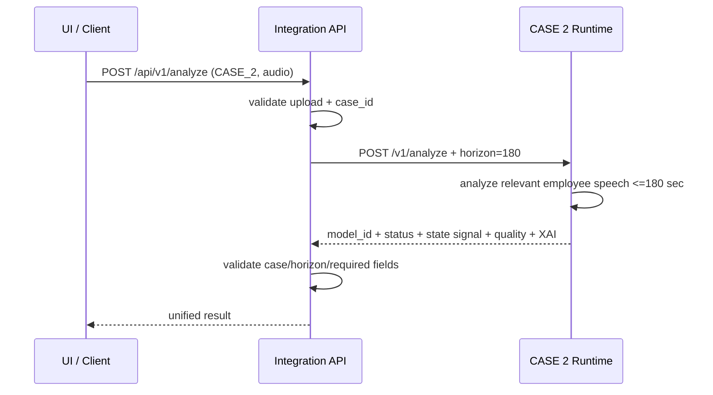
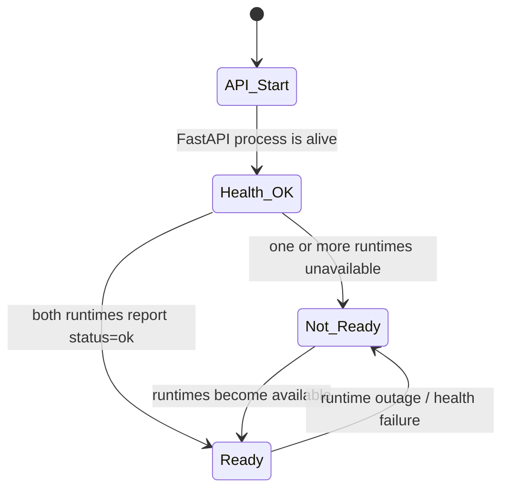
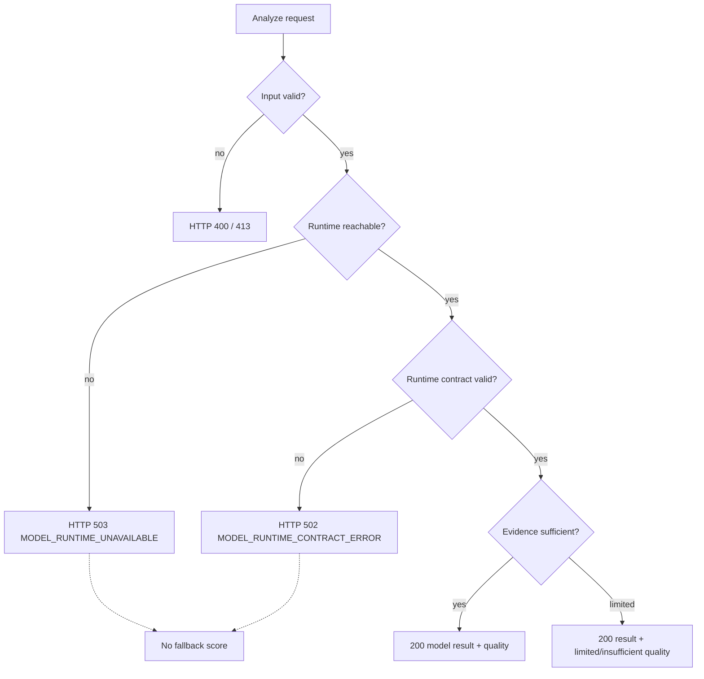
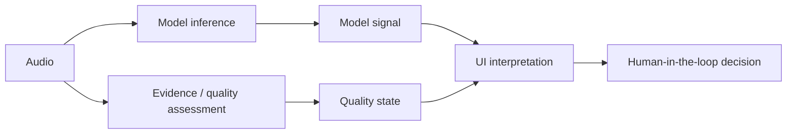
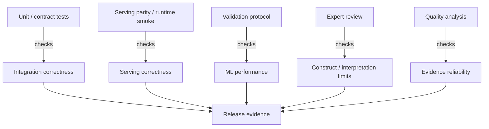
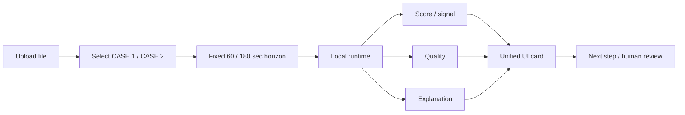
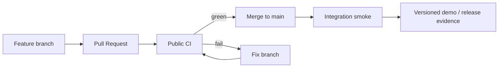

# Диаграммы архитектуры и потоков

GitHub рендерит Mermaid-диаграммы прямо в Markdown. Этот файл даёт визуальную карту решения без раскрытия закрытой внутренней реализации model runtime.

## 1. Общая архитектура

## 2. Public/private boundary

## 3. CASE 1 request sequence

## 4. CASE 2 request sequence

## 5. Health vs readiness

## 6. Error semantics

## 7. Quality is not prediction

## 8. Validation layers

## 9. Demo flow

## 10. Public release lifecycle

Диаграммы показывают публичную архитектуру. Они намеренно не изображают внутренние proprietary formulas, private datasets или model-training pipeline.
